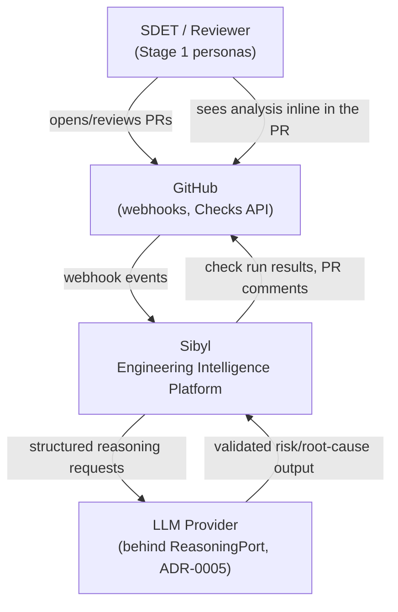
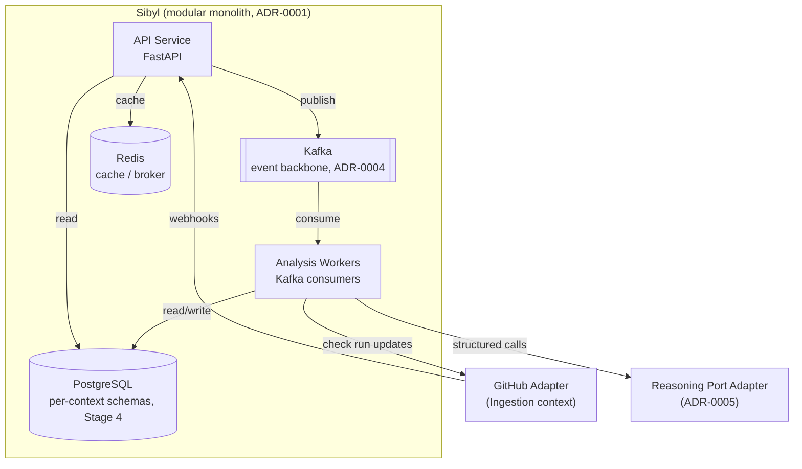
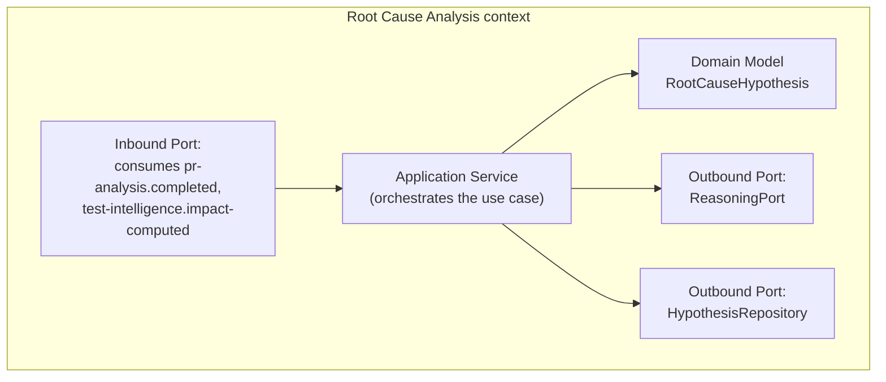
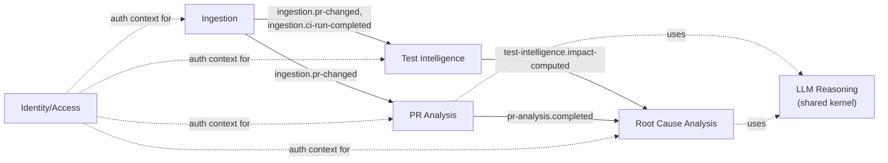

# Stage 3 — Architecture

**Status:** `APPROVED` (2026-07-02)
**Leads:** CTO, Principal Software Engineer, Staff Backend Engineer, Staff Platform Engineer
**Reviewers:** Full engineering leadership (all Staff/Principal/Senior roles)
**Entry criteria:** Stage 2 (Product Discovery) `APPROVED`.

## Goal

Decide the system's architectural style and boundaries, and record every non-trivial
decision as an ADR with alternatives and trade-offs — not just the choice made. This
is the highest-leverage, highest-argument stage: get the boundaries wrong here and
every later stage inherits the cost.

## Key questions / activities

These must each resolve to a decision with a written ADR (`docs/03-architecture/adr/`),
not just a diagram:

- **Modular monolith vs. microservices for v1.** Argue this explicitly: a
  microservices-first design demonstrates distributed-systems knowledge but adds
  operational tax (service discovery, distributed tracing overhead, deployment
  complexity) that is hard to justify for a project without production traffic yet.
  The likely senior-engineering call is a **modular monolith with strict bounded
  contexts enforced by hexagonal ports/adapters and package boundaries**, evolvable to
  services later where a context's scaling or team-ownership profile actually demands
  it. This must be argued and decided here, not assumed.
- **Bounded context map**: which of the MVP (and later, all 17) capabilities belong
  to which bounded context, and where the context boundaries actually are (e.g. is
  "ingestion" one context or one per source system? is "risk scoring" shared
  infrastructure or per-capability?).
- **CQRS boundary**: where does the split between write-side domain logic and
  read-side query/projection models actually pay for itself here (likely: ingestion
  and analysis are write/event-heavy, dashboards/API queries are read-heavy —
  justify, don't assume, that CQRS is worth its complexity for each context it's
  applied to).
- **Event-driven backbone**: what flows through Kafka vs. what's a synchronous
  FastAPI call. The likely shape is synchronous request/response for user-facing
  queries and an async event backbone for ingestion → analysis → projection pipelines
  — but name the specific topics and boundaries here.
- **LLM integration architecture**: LLM calls sit behind a port (model-agnostic
  interface), not scattered through business logic. Decide: RAG vs. structured
  tool-calling vs. prompt-pipeline-per-capability; how cost/latency budgets and model
  routing/fallback are enforced; how determinism/evaluation (Stage 8) is even possible
  given LLM non-determinism.
- **Multi-tenancy and auth model** at the architecture level (even if Stage 5 owns the
  API-level detail): single-tenant OSS deployment vs. multi-tenant SaaS-shaped design.
- **Scalability targets**: state assumptions (repos, PRs/day, events/sec) so later
  stages have a concrete number to design against instead of "web scale" hand-waving.

## Deliverables

- C4 model diagrams: Context, Container, Component levels.
- Bounded context map.
- ADRs for every decision above, each with alternatives considered and rejected, and
  the trade-off/cost reasoning — stored under `docs/03-architecture/adr/`.
- A named architectural style summary (which of DDD/Hexagonal/CQRS/Event-Driven apply
  where, and where they deliberately don't).

## Findings (final — approved 2026-07-02)

### ADRs

All 7 architecture decisions are recorded under `docs/03-architecture/adr/`:

| ADR | Decision |
|---|---|
| [0001](adr/0001-modular-monolith-over-microservices.md) | Modular monolith over microservices for v1 |
| [0002](adr/0002-bounded-context-map.md) | Bounded context map; GitHub-only for MVP |
| [0003](adr/0003-cqrs-boundary.md) | CQRS applied to PR Analysis, Test Intelligence, Root Cause Analysis only |
| [0004](adr/0004-event-driven-backbone.md) | Kafka for ingestion→analysis, synchronous API for reads |
| [0005](adr/0005-llm-integration-architecture.md) | LLM behind a reasoning port; structured tool-calling, not RAG |
| [0006](adr/0006-multi-tenancy-and-auth-model.md) | Single-tenant deployment, multi-tenant-ready schema |
| [0007](adr/0007-scalability-targets.md) | MVP scalability targets (assumed, revisited in Stage 10) |

### C4 — Context diagram

### C4 — Container diagram (MVP)

### C4 — Component diagram (Root Cause Analysis context, representative)

*(Other MVP contexts follow the same port/adapter shape; per-context component
diagrams are elaborated as needed once Stage 4/5 fix their data/API contracts —
this one is representative, not exhaustive, per the "no speculative documentation
ahead of its stage" rule.)*

### Bounded context map

### Architectural style summary

| Quality | Applied where | Deliberately not applied |
|---|---|---|
| DDD (bounded contexts, ubiquitous language) | All 5 contexts (ADR-0002) | N/A — applied throughout |
| Hexagonal/Clean Architecture (ports & adapters) | Every context's boundary with GitHub, Kafka, Postgres, LLM | N/A — applied throughout |
| CQRS | PR Analysis, Test Intelligence, Root Cause Analysis (ADR-0003) | Ingestion, Identity/Access — no query pattern justifies it |
| Event-Driven Architecture | Ingestion → analysis pipeline (ADR-0004) | API reads (synchronous by design) |
| SOLID | Coding-level discipline, enforced at Stage 9 implementation | — |

## Decisions log

| Decision | Alternatives considered | Rejected because | Owner role |
|---|---|---|---|
| Modular monolith over microservices | Microservices-per-context; undifferentiated monolith | Operational tax unearned at current scale/team size; undifferentiated monolith blurs DDD discipline | CTO (ADR-0001) |
| Bounded contexts as listed; GitHub-only for MVP | Per-source-system contexts; split Test Intelligence; build GitLab adapter now | No domain justification for the first two; no persona evidence for the third | Principal SWE (ADR-0002) |
| CQRS on 3 analytical contexts only | CQRS everywhere; CQRS nowhere | Consistency alone isn't justification; single-model reads don't fit the analytical contexts' access pattern | Staff Backend Engineer (ADR-0003) |
| Kafka for ingestion→analysis, sync API for reads | Fully synchronous pipeline; Kafka for reads too | Blocking risks GitHub webhook timeouts; event-sourcing reads is unneeded complexity | Staff Platform Engineer (ADR-0004) |
| LLM behind ReasoningPort, structured tool-calling | RAG over historical PRs; direct provider SDK calls; unstructured output | No retrieval problem exists yet in MVP; vendor coupling; untestable output | Senior AI Engineer (ADR-0005) |
| Single-tenant deployment, tenant-ready schema | Full multi-tenant SaaS now; no tenant key at all | No evidence for SaaS yet; retrofitting a tenant key later is expensive/risky | CTO (ADR-0006) |
| MVP scalability targets as stated | No stated targets; large-org targets | Leaves later stages guessing; no evidence for large-org scale | Staff Platform Engineer (ADR-0007) |
| *(Addendum, Stage 9.5)* CI/CD Optimization (Phase 2) joins Test Intelligence as a third capability, rather than a new context | New "Pipeline Optimization" context; modeling it as a shared kernel like LLM Reasoning | Same test-run-history model already shared by Test Impact Analysis and Flaky Detection — no distinct ubiquitous language; it has real domain meaning (unlike a shared kernel, which is a technical port with none) | Principal SWE (ADR-0002 addendum) |
| *(Addendum, Stage 9.4)* Coverage Intelligence (Phase 2) joins Test Intelligence as a fourth capability; a concrete threshold set — a fifth capability requires a mandatory context-split evaluation, not an optional revisit | New context; shared kernel | Same reasoning as the Stage 9.5 addendum, extended one capability further; four capabilities on one shared test-run-history fact is defensible, but the ceiling needed to stop being vague ("revisit later") before it became a rationalization for never splitting | Principal SWE (ADR-0002 addendum) |
| *(Addendum, Stage 9.6)* Dependency Analysis (Phase 2) is a new, sixth bounded context — not a fifth Test Intelligence capability | Fifth capability inside Test Intelligence; shared kernel | Running the Stage 9.4 threshold's mandatory evaluation for real: a dependency manifest shares no ubiquitous language with test-run history, unlike the four capabilities already merged. The threshold working as designed — the answer here is the opposite of 9.4/9.5's, on the same framework applied honestly | Principal SWE (ADR-0002 addendum) |
| *(Addendum, Stage 9.8)* API Evolution Tracking (Phase 2), scoped down to dependency-version breaking-change detection via semver, joins Dependency Analysis as a second capability — not a new context, and not literal OpenAPI-spec diffing | New context; literal OpenAPI-spec diffing (would need a new ingestion source for a different fact) | Same evaluation framework as 9.4/9.6, run in the joining direction this time: classifying a version change shares the same underlying fact (`dependency_manifest_snapshot`) already owned by this context, just a new question about it | Principal SWE (ADR-0002 addendum) |

## Architecture Review checklist (exit criteria)

- [x] Every MVP capability has a named bounded context home.
- [x] Every major decision above has a written ADR with rejected alternatives and
      explicit maintenance/scaling cost reasoning — not just "we chose X."
- [x] The monolith-vs-services decision is justified against this project's actual
      constraints (team size, traffic, deployment maturity), not decided by default
      or by resume-driven development.
- [x] LLM integration is behind a port/interface — no business logic directly calls a
      specific vendor SDK.
- [x] Scalability targets are concrete numbers, not adjectives.
- [x] Full engineering leadership has reviewed and stress-tested the ADRs (asked "why
      not the alternative" for each).
- [x] Sign-off logged as a dated entry in `PROGRESS.md`.

## Related docs

- Previous stage: `docs/02-product-discovery/README.md`
- Next stage: `docs/04-database/README.md`
- ADRs: `docs/03-architecture/adr/` (created when this stage starts)
- `PROGRESS.md` entries tagged Stage 3
