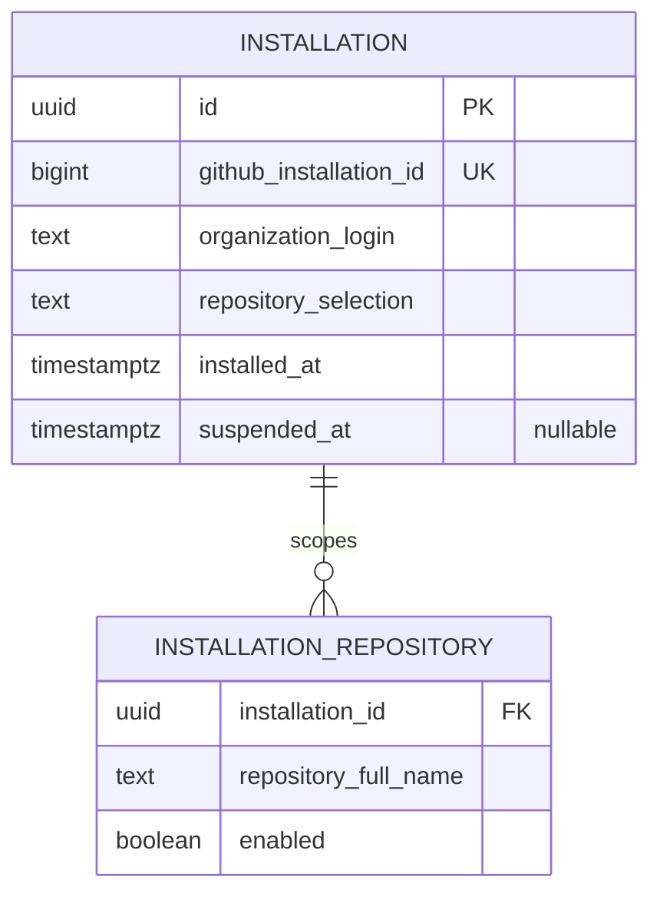
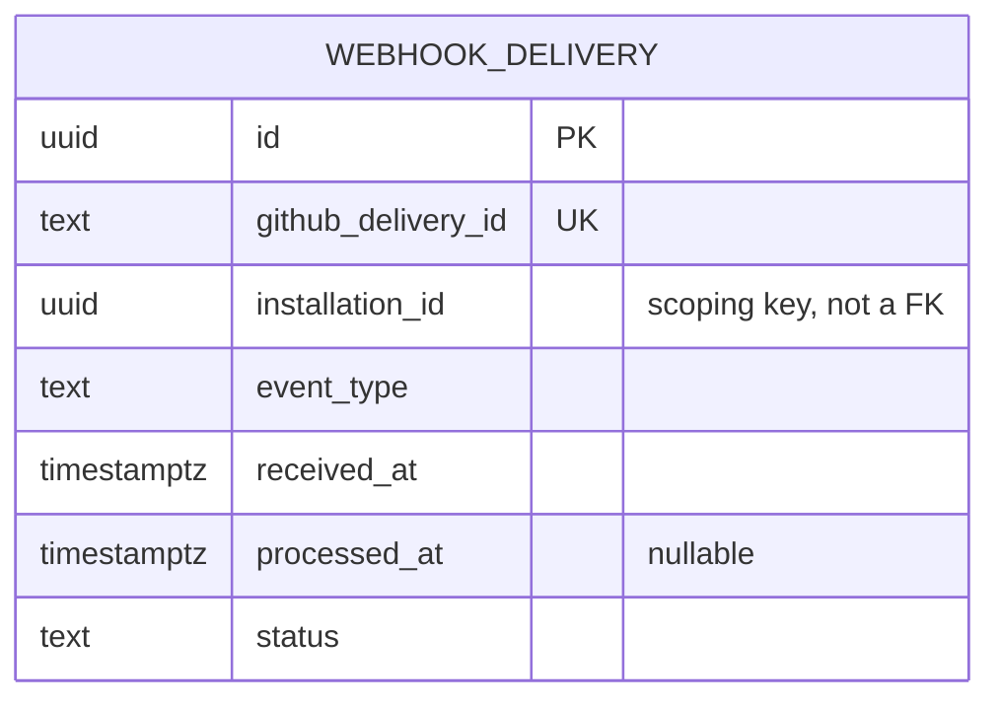
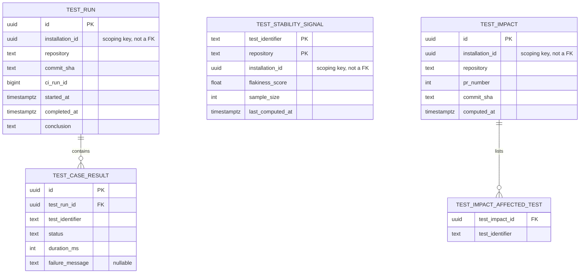
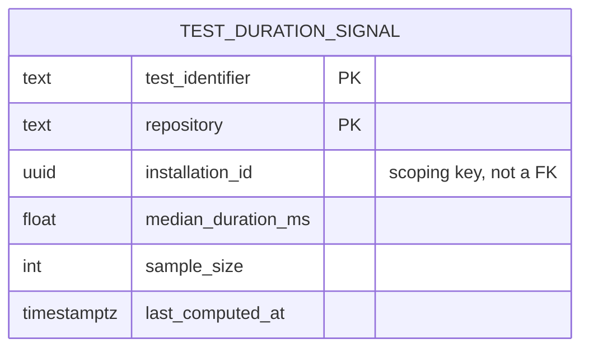
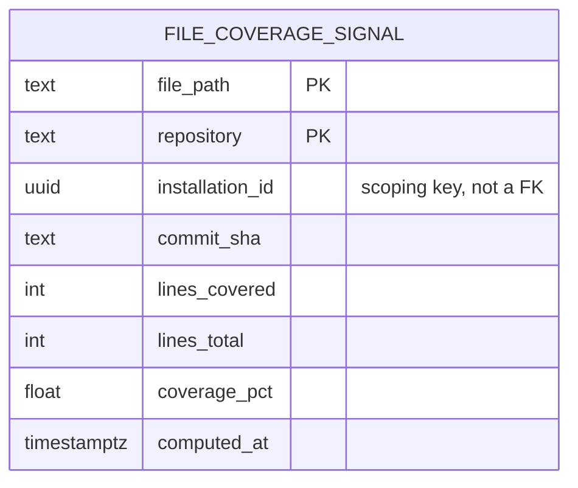
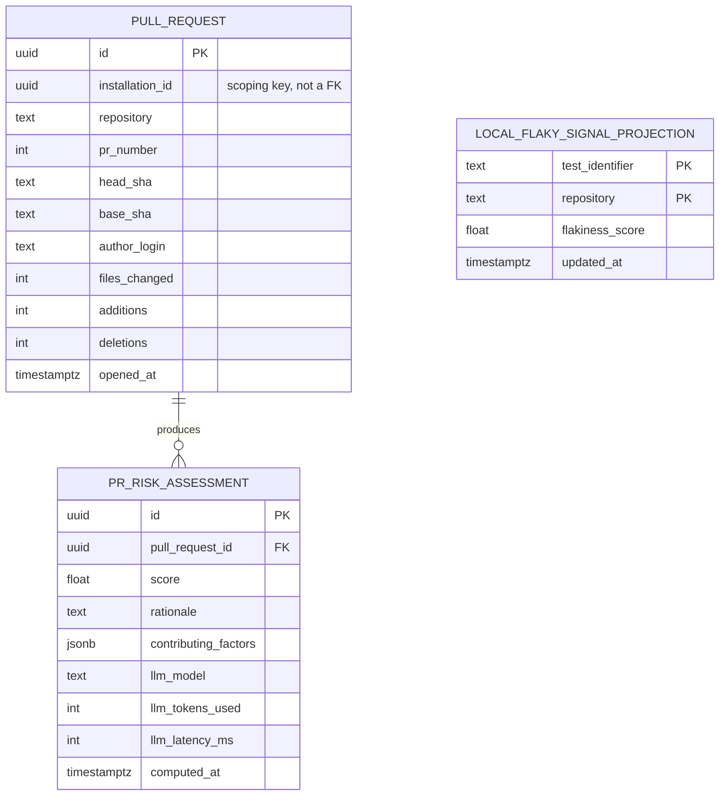
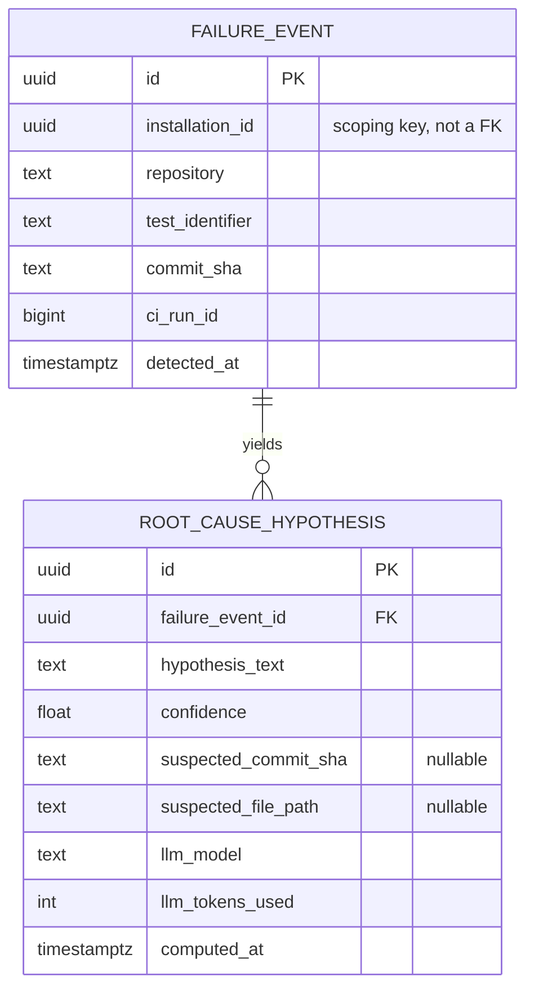
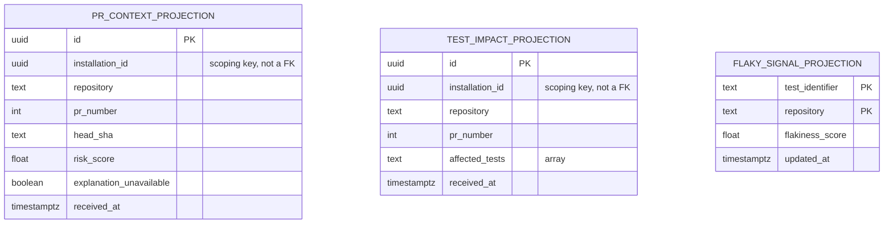
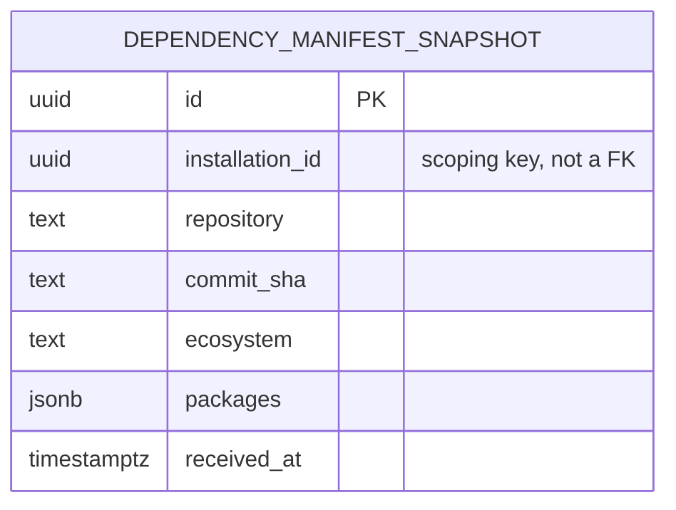

# Stage 4 — Database

**Status:** `APPROVED` (2026-07-02)
**Leads:** DB Architect
**Reviewers:** Principal Software Engineer, Staff Backend Engineer
**Entry criteria:** Stage 3 (Architecture) `APPROVED`.

## Goal

Design the persistence layer per bounded context, consistent with the boundaries
frozen in Stage 3. The core discipline here: no bounded context reaches into another
context's tables directly (no cross-context foreign keys, no shared mutable schema) —
contexts talk through events or explicit APIs, or the Stage 3 boundaries are
fictional.

## Key questions / activities

- **Schema per bounded context**: entities, relationships, ownership — each context
  owns its schema; cross-context data needs flow through events/read models, not
  joins.
- **Event store / outbox pattern**: how domain events are reliably published to Kafka
  without dual-write inconsistency (transactional outbox vs. CDC — pick one and
  justify it against this project's operational complexity budget).
- **Kafka topic design**: for every topic — name, key, schema (and how it's
  versioned/registered), retention policy, producers, consumers. This is a contract
  between bounded contexts and must be treated as seriously as the API contract in
  Stage 5.
- **Redis usage catalog**: every use of Redis must be named and justified
  individually — cache, Celery broker, rate limiting, distributed lock, session store
  — Redis is not a junk drawer for "things that need to be fast."
  Different uses may warrant different eviction/persistence configuration.
- **Migration strategy**: Alembic workflow, how schema changes roll out without
  downtime, how they're tested (this feeds Stage 8's testing strategy).
  Also: how does the *platform itself* dogfood its own "API Evolution Tracking"
  capability's discipline on its own schema evolution?
  Also: how does the platform's own "API Evolution Tracking" discipline get modeled
  here — is a schema-change event itself a first-class domain event this system
  should probably ingest about itself eventually?
- **Data retention & privacy**: what's ingested from GitHub/GitLab/Jira/etc. that
  could be sensitive (author identity, code snippets, comments), how long it's kept,
  and how deletion/right-to-be-forgotten-style requests would be honored if this were
  a real multi-tenant SaaS.

## Deliverables

- ERDs per bounded context.
- Kafka topic catalog (topic, key, schema/version, retention, producers, consumers).
- Redis usage catalog (use case, data shape, eviction/persistence policy, owning
  context).
- Migration/versioning strategy document.
- Data retention & privacy policy.

## Findings (final — approved 2026-07-02)

### Persistence topology: one Postgres database, six schemas

Consistent with ADR-0001 (modular monolith): **one Postgres database, one schema
per bounded context** (`ingestion`, `identity`, `test_intelligence`, `pr_analysis`,
`root_cause_analysis`, `dependency_analysis` *(Stage 9.6 addendum — sixth
context, see the ADR-0002 addendum)*), not six separate databases. This is the same argument as
ADR-0001 applied one layer down — physical separation isn't earned yet, but logical
separation (schemas, no cross-schema FKs, separate Alembic migration branches per
schema) is enforced from day one so a context can be split into its own database
later without a redesign. **No table has a foreign key into another context's
schema — ever.** Cross-context data needs are satisfied by each context
materializing its own local, eventually-consistent read-model from the other
context's Kafka events (ADR-0004) — never by a join.

### Schema per context (ERDs)

**`identity`** — owns installations, not tokens (tokens are short-lived, cached in
Redis, not persisted — see Redis catalog):

**`ingestion`** — deliberately thin; its job is dedup + normalize + publish, not
long-term storage:

**`test_intelligence`** — owns test run history and the two read-models (Test
Impact Analysis + Flaky Detection) built from it:

*(Addendum, Stage 9.5)* A third read-model, `TEST_DURATION_SIGNAL`, added for
CI/CD Optimization — joined ADR-0002's bounded-context map as a third
capability of Test Intelligence rather than a new context (see the ADR-0002
addendum):

Deliberately shaped like `TEST_STABILITY_SIGNAL` (same PK, same
`installation_id`/`sample_size`/`last_computed_at` fields) — both are
recomputed the same way, from the same rolling window over `TEST_CASE_RESULT`
history, on the same `ingestion.ci-run-completed` event. "Slow but not
flaky" is answered at query time by joining these two tables, not by adding a
denormalized `is_flaky` flag to this one — the two signals are computed and
owned independently, joining them is a read-time concern of the API layer.

*(Addendum, Stage 9.4)* A fourth read-model, `FILE_COVERAGE_SIGNAL`, added
for Coverage Intelligence — the fourth (and, per the ADR-0002 addendum, last
without a mandatory context-split re-evaluation) capability of Test
Intelligence:

Unlike `TEST_STABILITY_SIGNAL`/`TEST_DURATION_SIGNAL`, this is **not** a
rolling-window signal — coverage percentage is a snapshot fact about a
specific commit, not something that benefits from smoothing across history
the way a flaky/slow classification does. Each report simply overwrites the
previous one per `(repository, file_path)`; `commit_sha` records which
commit the snapshot is from, for traceability, not for windowing.

Reuses `pr_changed_files_projection` (already owned by this context, from
9.1/9.2) rather than building a parallel "how often does this file change"
tracker — a coverage gap is only interesting in the context of files that
are actually being changed, and that data already exists here.

**`pr_analysis`** — deliberately does **not** persist full diff content (GitHub
remains the source of truth for that; re-fetched on demand when a hypothesis needs
it, never duplicated at rest):

*(`LOCAL_FLAKY_SIGNAL_PROJECTION` is PR Analysis's own copy of Test Intelligence's
signal, populated by consuming `test-intelligence.flaky-signal-updated` — not a
join into `test_intelligence.test_stability_signal`.)*

**`root_cause_analysis`**:

*(Addendum, Stage 9.9)* Three local read-side projections were missing from the
original ERD above — `root_cause_analysis` needs its own copy of two other
contexts' events to correlate against, the same pattern already used by
`pr_changed_files_projection` (Test Intelligence) and
`local_flaky_signal_projection` (PR Analysis):

`PR_CONTEXT_PROJECTION` and `TEST_IMPACT_PROJECTION` are unique on
`(repository, pr_number)`; `FAILURE_EVENT` is unique on `(repository,
test_identifier, commit_sha, ci_run_id)` for consumer idempotency. See the
Stage 9.9 sub-stage doc for why these three were missing and how correlation
uses them.

Note the recurring pattern: every analytical context (`pr_analysis`,
`root_cause_analysis`, and `test_intelligence`'s signal tables) stores its own
`llm_model` / `llm_tokens_used` fields directly on its result row rather than a
separate shared "LLM usage" table — this is what feeds the Stage 2 "LLM cost per
analysis" guardrail metric via aggregation, without inventing a shared-kernel table
that no context truly owns.

*(Addendum, Stage 9.6)* **`dependency_analysis`** — a new, sixth schema (see
the ADR-0002 addendum). Unlike every signal table above (which store *current
state*, overwritten on each recompute), this table stores **history** — a row
per `(repository, commit_sha, ecosystem)`, never overwritten, because a
manifest snapshot at a specific commit is exactly what a future diffing
capability (9.8, API Evolution Tracking) needs to compare across commits:

`packages` is a JSONB array of `{name, version, direct}` objects — the same
"normalized shape, not a raw artifact" principle already used for
`test_case_result` and `file_coverage_signal`: the CI job parses its own
`package.json`/`requirements.txt`/`go.mod`/etc. into this shape; this endpoint
never parses a real manifest format itself. Unique on `(repository,
commit_sha, ecosystem)` — re-ingesting the same commit's report is an
idempotent upsert, but a new commit always gets a new row (no overwrite
across commits, unlike the signal tables).

No outbox table yet — nothing downstream consumes a "manifest received"
event today (9.8 doesn't exist yet); add one when a real consumer does,
same reasoning already applied to `test_duration_signal`/`file_coverage_signal`
having no downstream event either.

*(Addendum, Stage 9.8)* API Evolution Tracking — scoped to dependency-version
breaking-change detection, see the ADR-0002 addendum — needed **no new
table**. It reads two existing `DEPENDENCY_MANIFEST_SNAPSHOT` rows for the
same `(repository, ecosystem)` and diffs them at request time; a diff has no
independent existence worth persisting (it's fully re-derivable from the two
snapshots that already exist), so storing one would be exactly the kind of
speculative table this project has avoided elsewhere (no "LLM usage" table,
no full-diff-content storage). This is the cheapest possible extension of an
existing context — the strongest sign the ADR-0002 addendum's "join, don't
split" call was right.

### Reliable event publishing: transactional outbox, not CDC

Each context's schema includes its own `outbox_event` table (e.g.
`pr_analysis.outbox_event`), written in the **same transaction** as the domain
write. A separate relay process polls each context's outbox table and publishes to
Kafka, marking rows as sent.

**Rejected: CDC (e.g. Debezium reading the Postgres WAL).** CDC avoids the
relay-polling component but requires standing up Kafka Connect, replication slot
management, and schema-mapping infrastructure — real operational cost with no
current justification for a single-developer modular monolith (ADR-0001's argument,
again, one layer down). Transactional outbox is the lower-ops, still-correct choice
for this project's actual scale.

### Kafka topic catalog (schemas, versioning)

Extending ADR-0004's topic list with the versioning approach: every event is a JSON
envelope `{"schema_version": int, "event_type": str, "occurred_at": datetime,
"installation_id": uuid, "payload": {...}}`, validated against a versioned Pydantic
model shared via an internal `sibyl-events` contract package (not a full Confluent
Schema Registry — unjustified operational cost at this scale, same reasoning as the
outbox-over-CDC call). Breaking payload changes bump `schema_version`; consumers
handle at least the current and previous version during rollout.

| Topic | Key | Producer | Consumers | Retention |
|---|---|---|---|---|
| `ingestion.pr-changed` | `installation_id:repository:pr_number` | Ingestion | Test Intelligence, PR Analysis | 7 days |
| `ingestion.ci-run-completed` | `installation_id:repository:commit_sha` | Ingestion — *`POST /ingest/test-results`, not the GitHub webhook (Stage 9.2 addendum below)* | Test Intelligence, *Root Cause Analysis (Stage 9.9 addendum below)* | 7 days |
| `ingestion.coverage-report-received` *(Stage 9.4 addendum)* | `installation_id:repository:commit_sha` | Ingestion — `POST /ingest/coverage-report` | Test Intelligence | 7 days |
| `ingestion.dependency-manifest-received` *(Stage 9.6 addendum)* | `installation_id:repository:commit_sha` | Ingestion — `POST /ingest/dependency-manifest` | Dependency Analysis | 7 days |
| `test-intelligence.impact-computed` | `installation_id:repository:pr_number` | Test Intelligence | Root Cause Analysis | 30 days |
| `test-intelligence.flaky-signal-updated` | `installation_id:repository:test_identifier` | Test Intelligence | PR Analysis, *Root Cause Analysis (Stage 9.9 addendum below)* | 30 days (compacted on key) |
| `pr-analysis.completed` | `installation_id:repository:pr_number` | PR Analysis | Root Cause Analysis, GitHub Checks adapter | 30 days |
| `root-cause.hypothesis-ready` | `installation_id:repository:pr_number` | Root Cause Analysis | GitHub Checks adapter | 30 days |

Short retention on raw ingestion topics (7 days) — they're a relay mechanism, not a
system of record (Postgres is); longer retention on computed-result topics (30
days) supports consumer replay/recovery without treating Kafka as a database.

### Redis usage catalog

| Use case | Key pattern | TTL / eviction | Owning context | Why Redis, specifically |
|---|---|---|---|---|
| GitHub installation token cache | `gh:token:{installation_id}` | TTL ~55 min (tokens expire at 60 min) | Identity/Access | Avoids re-fetching a token from GitHub on every call; never persisted to Postgres because it's regenerable and short-lived by design |
| Webhook delivery dedup (fast path) | `dedup:webhook:{github_delivery_id}` | TTL 10 min, `SETNX` | Ingestion | Fast in-memory guard against duplicate delivery races; `ingestion.webhook_delivery` in Postgres is the durable record, this is just the fast check |
| GitHub API rate-limit budget | `ratelimit:gh:{installation_id}` | Sliding window, TTL 1 hour | Ingestion | GitHub enforces per-installation API rate limits; tracking spend locally avoids surprise 429s |
| Analysis result read-through cache | `cache:{context}:{entity_id}` (e.g. `cache:pr-analysis:{pr_id}`) | TTL 30s, invalidated on write | PR Analysis, Test Intelligence, Root Cause Analysis (each its own namespace) | Reduces Postgres load for repeatedly-polled results (e.g. GitHub Checks re-rendering); short TTL because results are actively being computed |
| Inbound API rate limiting *(added in Stage 5)* | `ratelimit:api:{jwt_subject}` | Token-bucket, TTL 1 min | API layer (cross-cutting, not a single bounded context) | Protects the public API from abuse without a separate gateway component — consistent with ADR-0001's modular-monolith reasoning; see `docs/05-api-design/README.md` |

Every use is individually named, has an explicit eviction policy, and an owning
context — none is a generic "misc" cache.

### Migration strategy

Alembic, with **one migration branch per schema** (5 branches in one Alembic
setup) — this makes "which context does this migration touch" enforced by tooling,
not just convention, consistent with the no-cross-schema-FK rule. Schema changes
roll out via the standard **expand-contract** pattern (add nullable → backfill →
deploy code that uses it → make non-null / drop old column in a later migration) —
no big-bang schema changes, no downtime deploys. CI runs every branch's migrations
against a fresh testcontainer Postgres (Stage 7/8 detail, referenced here for
completeness).

*(Addendum, Stage 9.5)* **Found and fixed a real, latent tooling bug affecting
all 5 branches, not just this one**: `alembic/env.py`'s `context.configure()`
never set `include_schemas=True`. Autogenerate's schema comparison only
reflects the database's *default* schema unless told otherwise — every prior
migration was either the first-ever revision on its branch (nothing to diff
against) or didn't need a second revision, so this never surfaced. The first
real incremental migration on an existing branch (adding `test_duration_signal`
to the already-populated `test_intelligence` schema) exposed it immediately:
autogenerate proposed re-creating all 7 already-existing `test_intelligence`
tables alongside the one genuinely new table, because it couldn't see that they
already existed in a non-default schema. Applying that migration as generated
would have failed outright at `CREATE TABLE ... already exists` — a fail-fast
break, not silent data loss, but it would have blocked every future
incremental migration on any of the 5 branches, not just this context's. Fixed
by adding `include_schemas=True` to both `context.configure()` calls
(online and offline); regenerated and verified the migration then contained
only the one new table.

**On dogfooding "API Evolution Tracking" against our own schema evolution:**
honestly — not in MVP. API Evolution Tracking is a Phase 2 capability; building a
self-referential pipeline where Sibyl ingests its own migration history now would
be solving a problem before the tool that solves it exists. The discipline for now
is the same as everywhere else in this project: every schema change is an Alembic
migration plus a Decisions-log entry. Once API Evolution Tracking ships, pointing
it at this repository's own migration history is a nice validation exercise — but
that's a Phase 2 idea, not an MVP requirement, and is noted here only so it isn't
forgotten.

### Data retention & privacy policy

- **What's ingested:** PR metadata (author's GitHub login, file paths, commit SHAs,
  diff stats — not full diff content, see `pr_analysis` ERD above), test names and
  results, CI run metadata, and LLM-generated rationale text (which may quote small
  code fragments — treated under the same policy as the rest).
- **Retention:** `ingestion.webhook_delivery` dedup records purged after **30
  days** (only needed for short-term idempotency). Analysis results (risk
  assessments, hypotheses, stability signals) retained by default **indefinitely**
  (they're the product's accumulated value — historical trend data), but
  configurable per-installation to a shorter window if an operator wants one.
- **Deletion on uninstall:** when a GitHub App installation is suspended/deleted,
  a cascading deletion job removes every row scoped to that `installation_id`
  across all 5 schemas. This is only mechanically enforceable *because* every table
  carries `installation_id` as a scoping key (ADR-0006) — direct payoff of that
  decision.
- **PII stance:** GitHub logins are treated as pseudonymous identifiers already
  public on GitHub; no separate PII enrichment is performed. Whether LLM prompts
  could leak secrets present in a diff (e.g. an accidentally-committed key) is a
  real concern but a Stage 7/8 concern (secret-scanning before any external LLM
  call) — flagged here as a forward-reference, not solved in this stage.

## Decisions log

| Decision | Alternatives considered | Rejected because | Owner role |
|---|---|---|---|
| Single Postgres database, 5 schemas (one per bounded context), no cross-schema FKs | 5 separate physical databases | Physical isolation unearned at current scale; same "monolith first" reasoning as ADR-0001, applied to the DB layer | DB Architect |
| Transactional outbox per context, relay process publishes to Kafka | CDC (Debezium reading Postgres WAL) | CDC requires Kafka Connect + replication-slot management — real ops cost with no current justification | DB Architect |
| Do not persist full diff content; store metadata only (files changed, +/- counts), fetch full diff from GitHub on demand | Persisting full diff content locally | GitHub is already the durable source of truth for diffs; duplicating it adds storage and a second copy to keep consistent for no benefit | DB Architect / Staff Backend Engineer |
| Retention: 30-day purge for webhook dedup records; indefinite-by-default for analysis results; cascading delete of all `installation_id`-scoped data on GitHub App uninstall | Uniform retention window for everything; no automated deletion on uninstall | Dedup records have no value past the idempotency window; analysis results are the product's accumulated value; uninstall-triggered deletion is both correct practice and only mechanically enforceable because of the ADR-0006 `installation_id` scoping key | DB Architect / CTO |
| *(Addendum, Stage 5)* Add inbound API rate-limiting as a 5th Redis use case | Handling rate limiting only at a future API gateway (Stage 7) | An API-layer limit is needed regardless of whether a gateway is added later; documenting it here keeps this catalog the single source of truth instead of letting Stage 5 quietly define Redis usage on the side | DB Architect / Staff Backend Engineer |
| *(Addendum, Stage 9.2)* `ingestion.ci-run-completed`'s real producer is `POST /ingest/test-results` (a CI-job-facing API endpoint), not the GitHub `check_suite`/`workflow_run` webhook originally assumed | Deriving per-test results from GitHub's native webhook | GitHub's webhook has no per-test data — only a suite-level conclusion. The `test_case_result` schema (test_identifier-level) was frozen at this stage assuming data existed; implementation revealed it needs a dedicated reporting endpoint. Topic name/shape/consumers are unchanged, only the producer. | DB Architect / user |
| *(Addendum, Stage 9.9)* Added `pr_context_projection`, `test_impact_projection`, `flaky_signal_projection` to `root_cause_analysis`; made Root Cause Analysis a direct consumer of `ingestion.ci-run-completed` and `test-intelligence.flaky-signal-updated` | Having Ingestion write `failure_event` directly into `root_cause_analysis`'s schema, as Stage 6's original sketch implied; correlating without local copies of the other two contexts' events | The original sketch had Ingestion reach into another context's schema, violating the "no cross-schema writes" rule this same table enforces everywhere else — and Ingestion has no per-test pass/fail data to act on regardless (that lives in Test Intelligence). Correlating "PR changes + test impact + flakiness" (the Stage 9 roadmap's own description of this capability) without a local copy of each signal would require reading other contexts' tables directly, which ADR-0002 forbids. Root Cause Analysis now creates its own `failure_event` rows from a topic it consumes itself, exactly like every other context already does. | DB Architect / user |
| *(Addendum, Stage 9.5)* Added `test_duration_signal` to `test_intelligence`, recomputed on the same `ingestion.ci-run-completed` event as `test_stability_signal`, no new Kafka topic | Publishing a `test-intelligence.duration-updated` event, mirroring flakiness | Nothing outside Test Intelligence needs to react to a duration change — flakiness is consumed by PR Analysis and Root Cause Analysis for risk context; slowness has no such downstream consumer yet. An event with no consumer is speculative infrastructure; add one if a real consumer appears. | DB Architect / user |
| *(Addendum, Stage 9.5)* `alembic/env.py` now sets `include_schemas=True` on both `context.configure()` calls | Leaving it unset (the default) | Without it, autogenerate can't see already-existing tables in any non-default schema when computing a diff — never surfaced before because every prior migration was either brand-new-branch or didn't need a second revision; the first real incremental migration on an existing branch (this one) proposed re-creating all 7 already-existing `test_intelligence` tables. Would have blocked every future incremental migration on any of the 5 branches, not just this one. | Staff Backend Engineer |
| *(Addendum, Stage 9.4)* Added `file_coverage_signal` to `test_intelligence` as a snapshot (not rolling-window) signal; added `ingestion.coverage-report-received` (new topic, `POST /ingest/coverage-report` producer) | Computing a rolling coverage trend like flakiness/duration; reusing `ingestion.ci-run-completed` instead of a dedicated coverage topic | Coverage percentage is a fact about a specific commit, not a classification that benefits from smoothing across history — a rolling window would answer a question nobody asked. A separate topic (rather than folding coverage into the existing test-results payload) keeps the two CI-job-facing contracts independently versionable — a CI job that only reports coverage shouldn't have to fabricate a per-test breakdown just to satisfy one schema. | DB Architect / user |
| *(Addendum, Stage 9.6)* Added a sixth schema, `dependency_analysis`, with `dependency_manifest_snapshot` storing **history** (a row per commit, never overwritten) rather than current-state-only like every other signal table; added `ingestion.dependency-manifest-received` | Overwriting per-repository like `file_coverage_signal`; folding into an existing topic | A manifest snapshot's whole future value (diffing across commits for 9.8, API Evolution Tracking) requires keeping each commit's snapshot queryable — overwriting would destroy exactly the data a downstream diffing capability needs. This is a genuinely different persistence shape than the other three Test Intelligence signals, which is itself part of the evidence that this doesn't belong in that context (see the ADR-0002 addendum). | DB Architect / user |

## Architecture Review checklist (exit criteria)

- [x] No schema has a foreign key or join crossing a Stage 3 bounded-context
      boundary.
- [x] Every Kafka topic has a documented owner, schema/version, and consumer
      contract.
- [x] Every Redis use case is individually named and justified — none are generic
      "misc cache."
- [x] The outbox/CDC decision for reliable event publishing is made and justified
      against operational complexity.
- [x] A concrete data retention/privacy policy exists, even for an OSS single-tenant
      deployment.
- [x] Principal SWE and Staff Backend have reviewed for boundary leakage
      specifically.
- [x] Sign-off logged as a dated entry in `PROGRESS.md`.

## Related docs

- Previous stage: `docs/03-architecture/README.md`
- Next stage: `docs/05-api-design/README.md`
- `PROGRESS.md` entries tagged Stage 4
