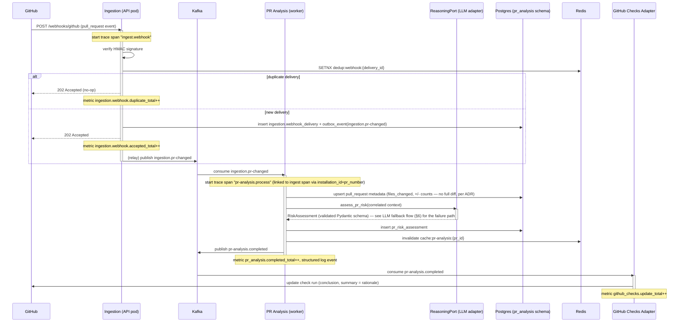
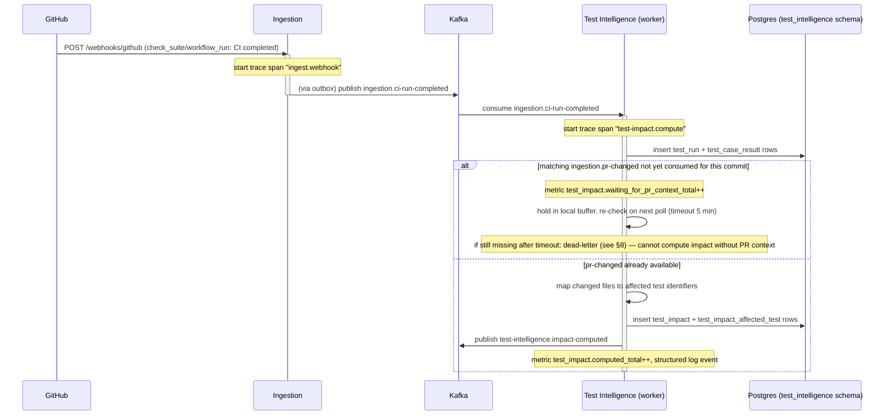
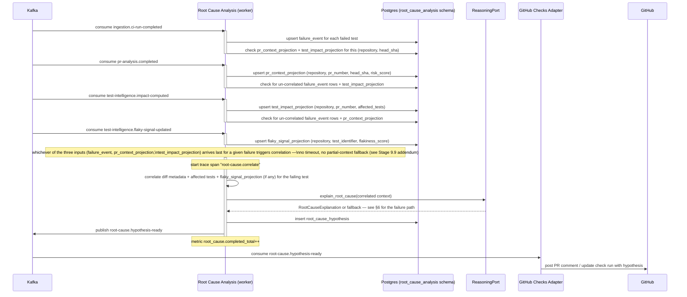
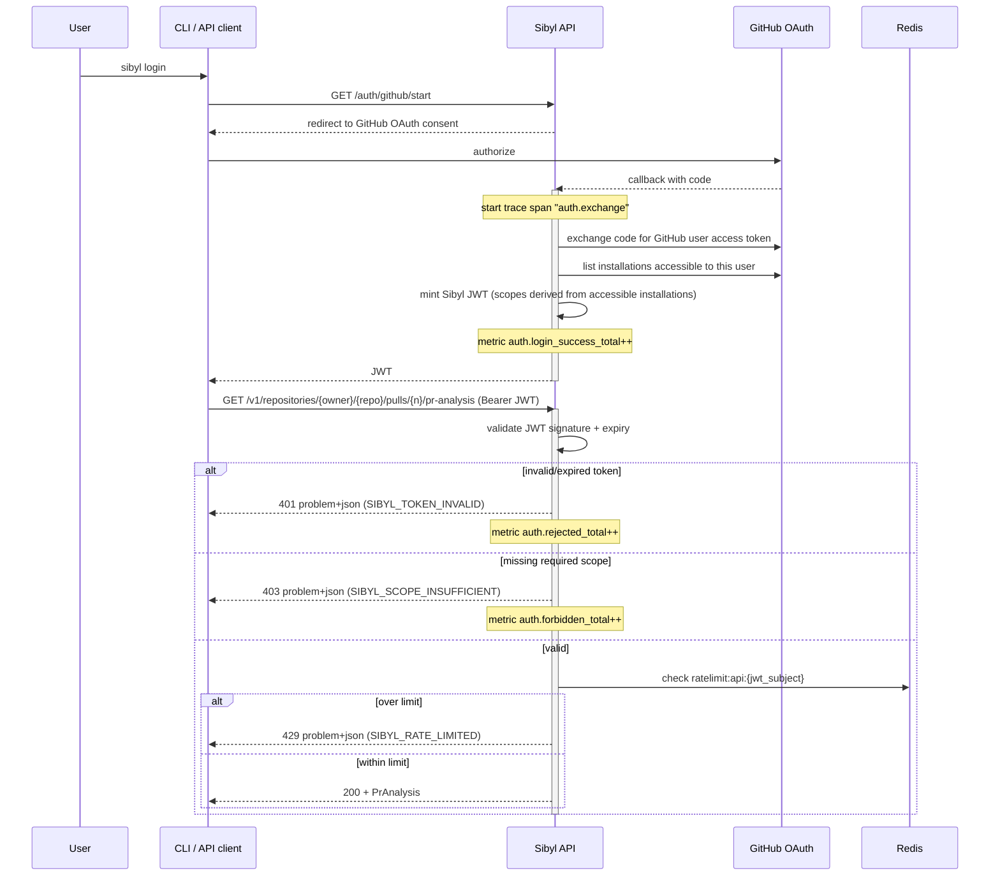
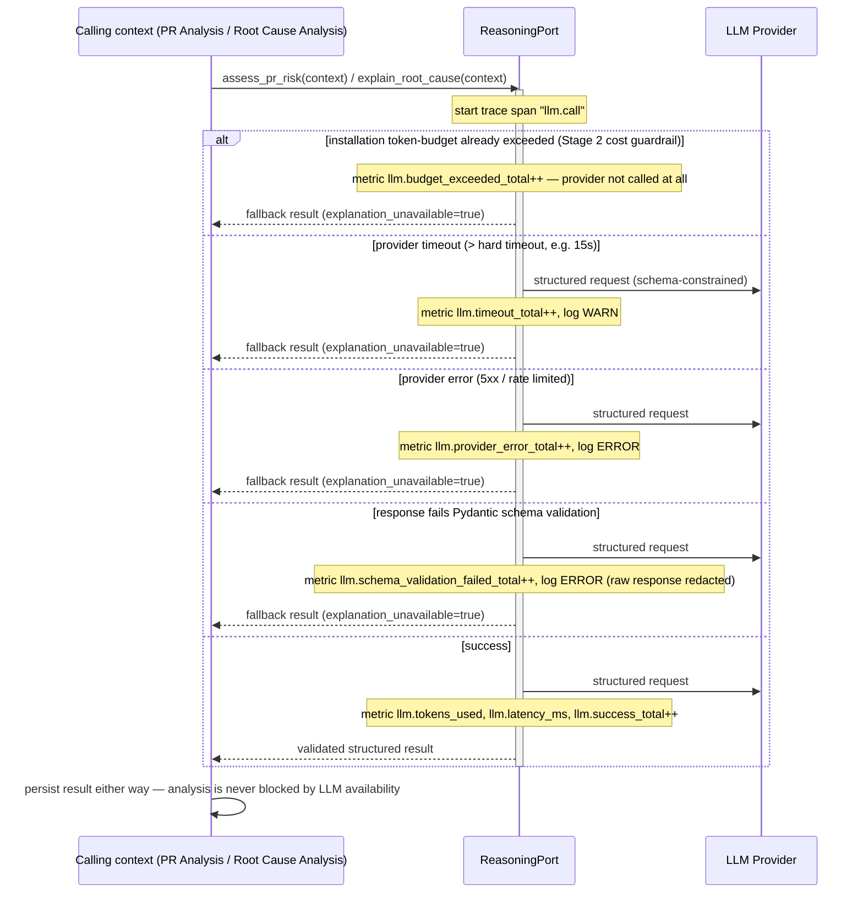
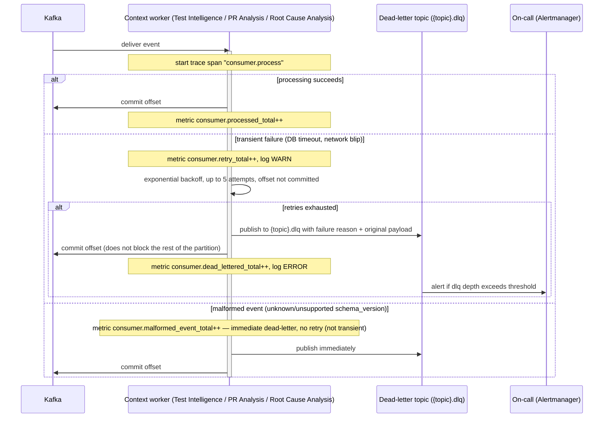
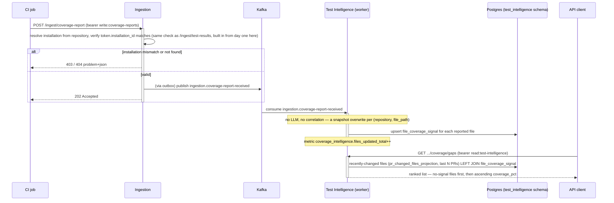
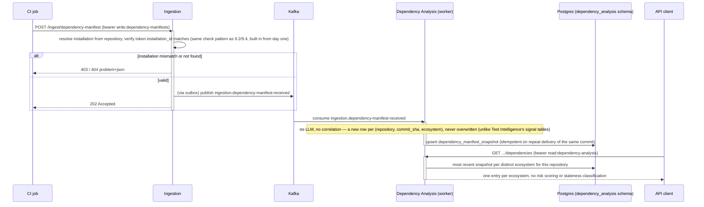

# Stage 6 — Sequence Diagrams

**Status:** `APPROVED` (2026-07-02)
**Leads:** Principal Software Engineer, Staff Backend Engineer, Staff Platform Engineer
**Reviewers:** CTO
**Entry criteria:** Stage 5 (API Design) `APPROVED`.

## Goal

Document every critical runtime flow end-to-end, including failure and retry paths
and observability touch points, before any of it is coded. A sequence diagram that
only shows the happy path is not a design artifact — it's a wish. This stage is what
lets Stage 8 (Testing Strategy) know what actually needs testing, and what lets
Stage 9 implementers build against an agreed flow instead of improvising integration
behavior mid-PR.

## Key questions / activities

- One diagram per MVP capability's primary flow (e.g. GitHub webhook received → event
  published → analysis service consumes → LLM call → result persisted →
  API/dashboard/webhook notifies consumer).
- One diagram per cross-cutting concern: authentication/authorization flow, ingestion
  failure and retry/backoff behavior, LLM call failure or budget-exceeded fallback
  behavior, event consumer failure and dead-letter handling.
- For every flow: where is a trace span started, where are metrics emitted, where is
  a structured log written — observability is designed into the flow, not bolted on
  during Stage 9.
- For every external-system flow (GitHub/GitLab/Jira/CI/CD webhooks): what happens on
  malformed payload, duplicate delivery, out-of-order delivery, and rate-limited
  upstream API — these are not edge cases for an integration-heavy platform, they are
  the normal case.

## Deliverables

- Mermaid sequence diagrams for every MVP flow, committed alongside this doc.
- Explicit error/retry/fallback paths on each diagram, not a separate "error cases"
  appendix that goes stale.
- Observability annotations (span/metric/log touch points) on each diagram.

## Findings (final — approved 2026-07-02)

**Consistency rule applied across every consumer flow below** (so the CTO-review
checklist item isn't just a formality): all Kafka consumers use the *same* retry
policy — exponential backoff, up to 5 attempts, dead-letter after exhaustion,
immediate dead-letter (no retry) for malformed/non-transient failures. No flow
reinvents this. All LLM calls use the *same* fallback contract: on any failure
(timeout, provider error, schema-validation failure, budget exceeded), the calling
context still persists a result — just without the LLM-generated explanation. No
capability is allowed to block or fail its whole analysis because the LLM was
unavailable.

### 1. PR Analysis — primary flow



### 2. Test Impact Analysis — primary flow (with out-of-order handling)



*(This is the out-of-order-delivery case the stage's key questions call out
explicitly: CI completion and PR metadata events can arrive in either order — the
flow buffers and re-checks rather than assuming an order.)*

### 3. Flaky Detection — stability recompute + downstream projection

```mermaid
sequenceDiagram
    participant TI as Test Intelligence (worker)
    participant PG as Postgres (test_intelligence schema)
    participant Kafka
    participant PRA as PR Analysis (worker)

    Note over TI: triggered after test_case_result insert (same consumption as §2)
    activate TI
    Note over TI: start trace span "flaky-detection.recompute"
    TI->>PG: recompute flakiness_score over recent test_case_result history
    alt flakiness_score changed materially (> threshold delta)
        TI->>PG: update test_stability_signal
        TI->>Kafka: publish test-intelligence.flaky-signal-updated
        Note over TI: metric flaky_detection.signal_updated_total++
    else no material change
        Note over TI: metric flaky_detection.recompute_skipped_total++ (no event published — avoids Kafka noise on every run)
    end
    deactivate TI

    Kafka->>PRA: consume test-intelligence.flaky-signal-updated
    activate PRA
    PRA->>PRA: update local_flaky_signal_projection (PR Analysis's own copy, per ADR-0002 — never a join)
    Note over PRA: structured log "local projection updated"; metric pr_analysis.projection_lag_ms (event time → applied time)
    deactivate PRA
```

*(`projection_lag_ms` directly answers the Stage 4 open risk: "what happens if a
consumer reads a projection before it's caught up" — it's measured, not ignored. A
read during the lag window simply sees the previous, still-valid signal.)*

### 4. Root Cause Analysis — primary flow (multi-input correlation)

*(Revised, Stage 9.9 — see the addendum in the Decisions log below. The original
sketch had Ingestion write directly into `root_cause_analysis`'s schema and used
a 2-minute join timeout with a "partial context, lower confidence" fallback;
implementation replaced both with the same kind of deterministic,
bidirectional-style correlation Stage 9.2 already established for Test Impact
Analysis, extended from two inputs to three. The guaranteed behavior — a
hypothesis eventually gets computed once all needed signal exists, in any
arrival order — is unchanged.)*



### 5. Authentication/authorization flow



### 6. LLM call failure / budget-exceeded fallback (cross-cutting)



### 7. Ingestion failure & retry/backoff (cross-cutting)

```mermaid
sequenceDiagram
    participant GH as GitHub
    participant Ing as Ingestion

    GH->>Ing: POST /webhooks/github
    activate Ing
    alt malformed payload
        Ing-->>GH: 400 problem+json
        Note over Ing: metric ingestion.malformed_total++, log WARN — GitHub does not retry on 4xx
    else invalid HMAC signature
        Ing-->>GH: 401 problem+json
        Note over Ing: metric ingestion.auth_failed_total++, log WARN (misconfigured secret, or an attack attempt)
    else outbox insert fails (DB unavailable)
        Ing-->>GH: 500
        Note over Ing: metric ingestion.internal_error_total++
        Note over Ing: GitHub retries with its own exponential backoff; safe because of delivery_id dedup (§1)
    else relay fails to publish an already-committed outbox row to Kafka
        Note over Ing: relay retries with backoff; row stays "unpublished" until acked
        Note over Ing: metric outbox.publish_retry_total++
        Note over Ing: after 5 attempts over 10 min — alert on-call; row kept for manual replay, never silently dropped
    else success
        Ing-->>GH: 202 Accepted
    end
    deactivate Ing
```

### 8. Event consumer failure & dead-letter handling (cross-cutting)



### 9. Coverage Intelligence — ingest + gap ranking (Stage 9.4 addendum)



This intentionally does **not** follow §6's LLM-fallback pattern (no LLM
involved — this is Test Impact Analysis's/Flaky Detection's cost profile,
not PR Analysis's/Root Cause Analysis's, per the Stage 9.4 sub-stage doc) and
does **not** publish a downstream event (no consumer exists yet, same
reasoning as 9.5's `test_duration_signal`).

### 10. Dependency Analysis — ingest + latest-per-ecosystem read (Stage 9.6 addendum)



Deliberately the simplest flow in this document: no LLM, no correlation
across contexts, no downstream event (same reasoning as 9.5's
`test_duration_signal`/9.4's `file_coverage_signal` — no consumer exists
yet). The one structural difference from §9's Coverage Intelligence flow:
this context **keeps history** (a new row per commit) rather than
overwriting a current-state signal, because 9.8 (API Evolution Tracking)
will need to diff manifests across commits later — see the Stage 9.6
ADR-0002 and Stage 4 addenda for why that pushed this into its own bounded
context instead of joining Test Intelligence.

### 11. API Evolution Tracking — read-time manifest diff (Stage 9.8 addendum)

```mermaid
sequenceDiagram
    participant Client as API client
    participant DA as Dependency Analysis
    participant PG as Postgres (dependency_analysis schema)

    Client->>DA: GET .../dependencies/changes?ecosystem=npm (bearer read:dependency-analysis)
    activate DA
    DA->>PG: two most recent dependency_manifest_snapshot rows for (repository, ecosystem)
    alt fewer than two snapshots exist
        DA-->>Client: 404 problem+json (nothing to diff yet)
    else two snapshots found
        DA->>DA: diff packages by name; classify each change by semver (major bump or removal = breaking)
        Note over DA: no LLM, no correlation, no write — purely a read-time computation over already-stored data
        DA-->>Client: 200 — added/removed/version-changed packages, each with a severity
    end
    deactivate DA
```

The simplest flow added yet: no Kafka involvement at all (nothing is
ingested or published here — this reads two rows §10 already wrote) and no
new persistence. See the Stage 9.8 ADR-0002 addendum for why this stayed
inside Dependency Analysis rather than becoming a new context, and the
Stage 9.8 sub-stage doc for why "breaking" is deliberately limited to a
semver major-version-bump heuristic, not literal OpenAPI-spec diffing.

## Decisions log

| Decision | Alternatives considered | Rejected because | Owner role |
|---|---|---|---|
| One uniform retry/dead-letter policy across all Kafka consumers (exponential backoff, 5 attempts, immediate dead-letter for non-transient failures) | A per-context retry policy tuned individually | Nothing about any context's failure modes justifies a different policy yet; a single policy is simpler to reason about, test, and operate — divergence should be evidence-driven later, not default | Principal SWE / CTO |
| One uniform LLM fallback contract (any failure → persist result without explanation, never block) across PR Analysis and Root Cause Analysis | Per-capability fallback behavior | Both contexts have the same underlying requirement (Stage 1: never let LLM availability gate a decision) — no reason for them to differ | Senior AI Engineer |
| Test Impact Analysis buffers on out-of-order events (5 min timeout) rather than assuming arrival order | Requiring strict event ordering; dropping/erroring on out-of-order arrival | GitHub webhook and CI-completion delivery order isn't guaranteed; erroring on a normal-case timing variance would create false negatives | Staff Platform Engineer |
| Parameters (5 retries, 15s LLM timeout) accepted as reasoned defaults, explicitly revisited with real data at Stage 10 | Leaving parameters undefined until implementation | Stage 9 needs concrete numbers to build against; treating them as provisional (like ADR-0007) avoids false precision | User |
| *(Addendum, Stage 9.9)* Root Cause Analysis's 3-input correlation (failure event, PR context, test impact) uses deterministic bidirectional-style correlation (whichever input arrives last triggers computation), not the originally-sketched 2-minute join timeout with a "partial context, lower confidence" fallback; Root Cause Analysis also became a direct consumer of `ingestion.ci-run-completed` (to build its own `failure_event` rows) instead of Ingestion writing into its schema | Keeping the 2-min timeout + partial-context fallback; keeping Ingestion as the writer of `failure_event` | Same reasoning as Stage 9.2's buffer-and-poll replacement, extended from 2 inputs to 3: the platform's uniform LLM fallback contract (§6) guarantees `pr-analysis.completed` always eventually publishes, and `test-intelligence.impact-computed` is guaranteed for any commit that has both a PR-changed event and a completed test run — which a `failure_event`'s existence already implies. No case exists where all three inputs never arrive for a real failure on an open PR, so a timeout has nothing real to guard against, only complexity ("what does 'lower confidence' even mean, quantitatively") to introduce. Separately, Ingestion has no per-test pass/fail data to act on (that lives in Test Intelligence, per the Stage 9.2 addendum) and writing into another context's schema violates the same cross-schema rule enforced everywhere else (ADR-0002) — Root Cause Analysis now derives `failure_event` from a topic it consumes itself. | Staff Platform Engineer / user |

## Architecture Review checklist (exit criteria)

- [x] Every MVP capability has a complete sequence diagram, not just a description.
- [x] Every diagram shows at least one failure/retry path, not only the happy path.
- [x] Every diagram marks where tracing/metrics/logging are emitted.
- [x] Diagrams are consistent with the Stage 3 architecture and Stage 4/5 contracts —
      no diagram invents a new component or endpoint that wasn't decided upstream.
- [x] CTO has reviewed for architectural consistency across flows (e.g. retry policy
      isn't reinvented differently per flow without reason).
- [x] Sign-off logged as a dated entry in `PROGRESS.md`.

## Related docs

- Previous stage: `docs/05-api-design/README.md`
- Next stage: `docs/07-infrastructure/README.md`
- `PROGRESS.md` entries tagged Stage 6
